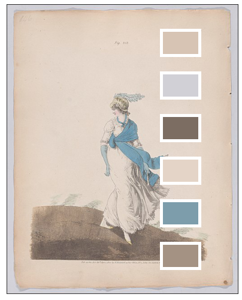
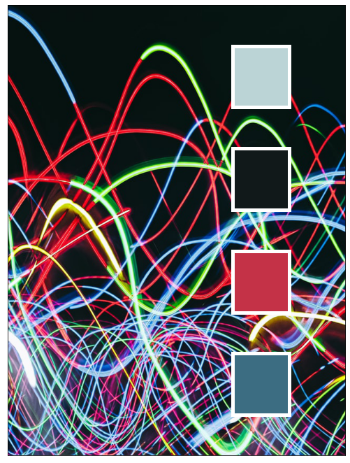
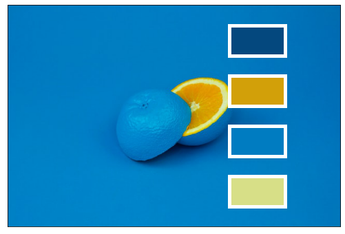

# Intro to Data Science | Machine Learning Behind Instagram and TikTok Filters

---

Erin Hoffman, Data Science Curriculum Developer at Flatiron School

May 25, 2022

https://github.com/learn-co-curriculum/dsc-kmeans-color-palette

Click this button to launch an interactive notebook in the browser: 

Images generated in this workshop:

